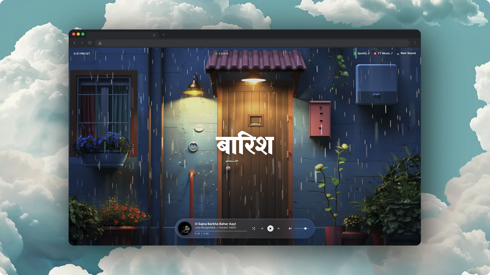
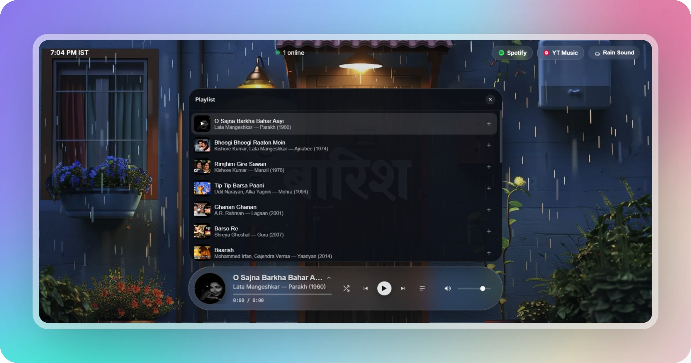

# _[Baarish — Jukebox](https://rain-jukebox.vercel.app/)_



A lightweight, embedded music player built with **Next.js** and **TypeScript** that streams audio via the **YouTube IFrame API** — no visible video, just a clean audio-player UI with full playback controls.

## Features

- **Play / Pause / Next / Previous** — standard transport controls
- **Shuffle mode** — randomized track order, always skips repeats
- **Seekable progress bar** — click anywhere on the track bar to jump to that point
- **Volume control** — slider with mute/unmute toggle, remembers your last volume
- **Auto-advance** — automatically plays the next track when one ends
- **Track metadata** — title, artist, and thumbnail pulled from a simple track list
- **Playlist with queue** — browse the full track list, jump to any song, and view what's up next
- **Rain sound toggle** — turn ambient rain audio on/off independent of the music player
- **No visible video** — the YouTube player is mounted off-screen; only the audio is used

__

## Tech Stack

- [Next.js](https://nextjs.org/) (App Router, `"use client"` component)
- TypeScript
- CSS Modules for styling
- [YouTube IFrame Player API](https://developers.google.com/youtube/iframe_api_reference) for audio playback

## Getting Started

```bash
npm install
npm run dev
```

Open [http://localhost:3000](http://localhost:3000) to view it in the browser.

## Adding Tracks

Tracks are defined in `@/lib/tracks` as a list of objects with at least an `id` (YouTube video ID), `title`, and `artist`:

```ts
export const tracks = [
  { id: "VIDEO_ID", title: "Song Title", artist: "Artist Name" },
  // ...
];
```

## Acknowledgements

Inspired by [Yash Bhardwaj's](https://x.com/ybhrdwj) **[Deluxe Salon](https://saloon.wtf/)**
